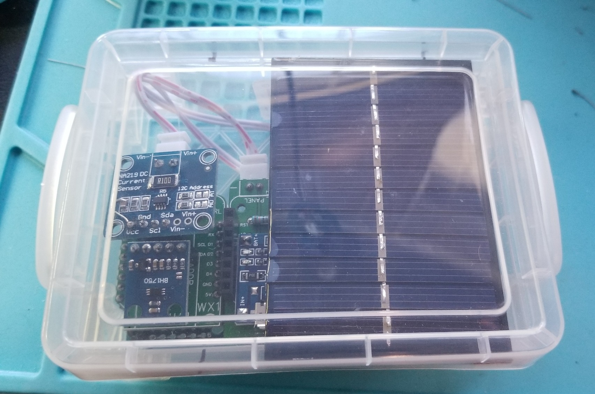

# Project Photo Gallery

## Bench View

### Side View with shields separated

### Top View with shields separated

### Side View of assembled unit

### Modification to charger board

### Installation

### Unit in the rain

### Unit reconfigured to use a tripler base

### Self-contained version with tripler base & solar panel mounted inside crayon box

