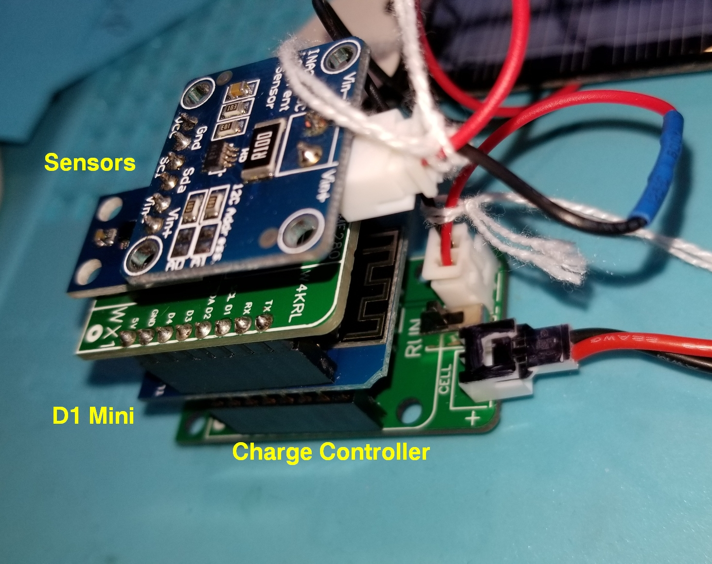
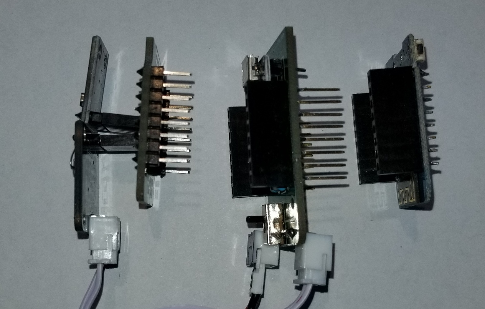
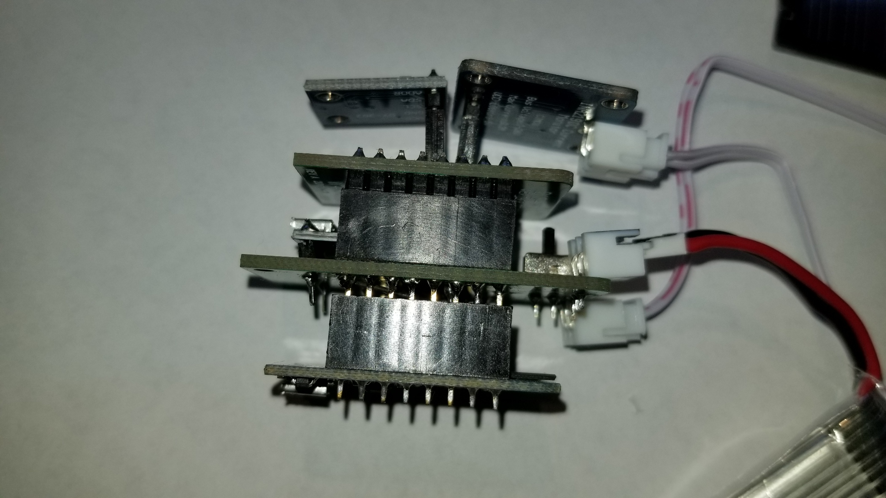
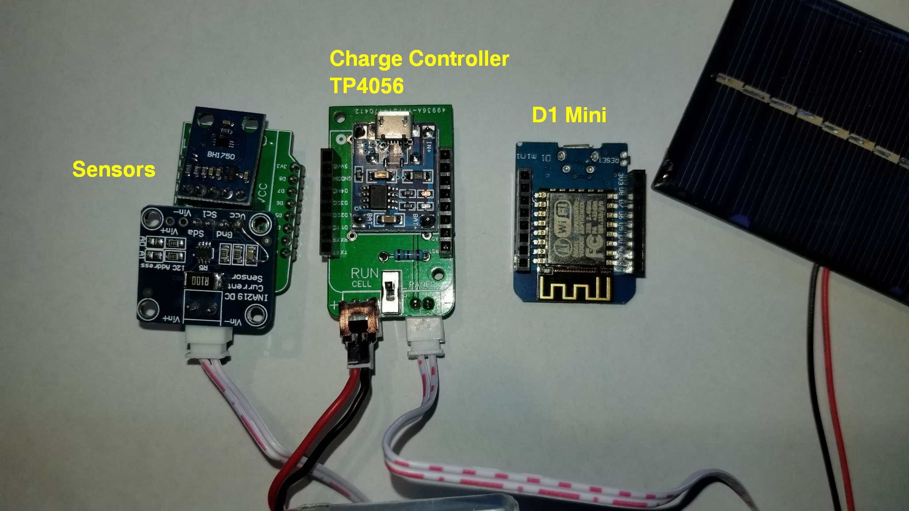
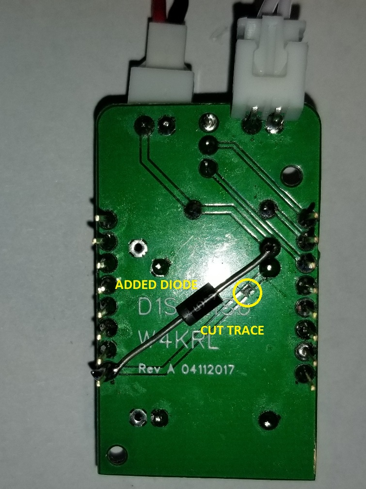
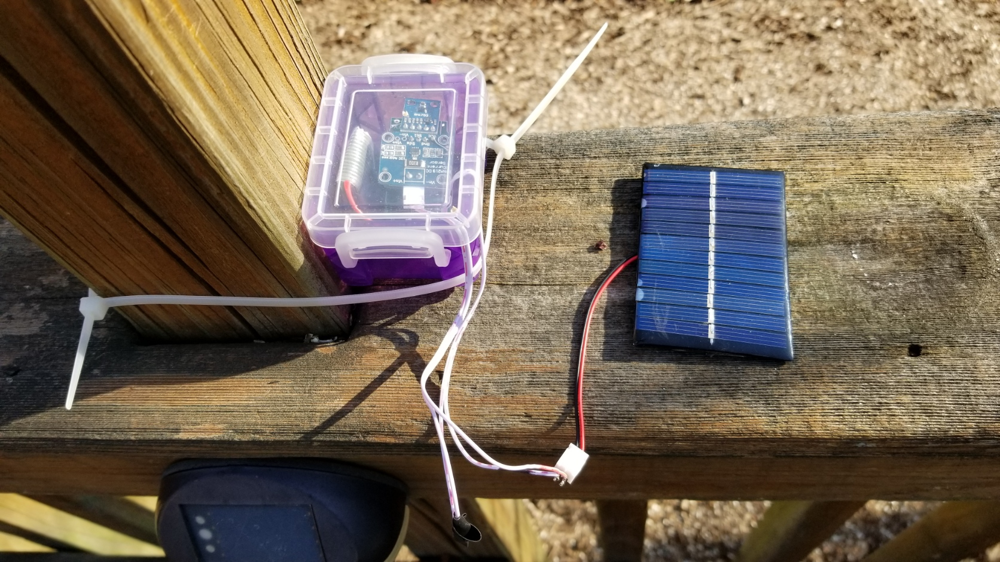
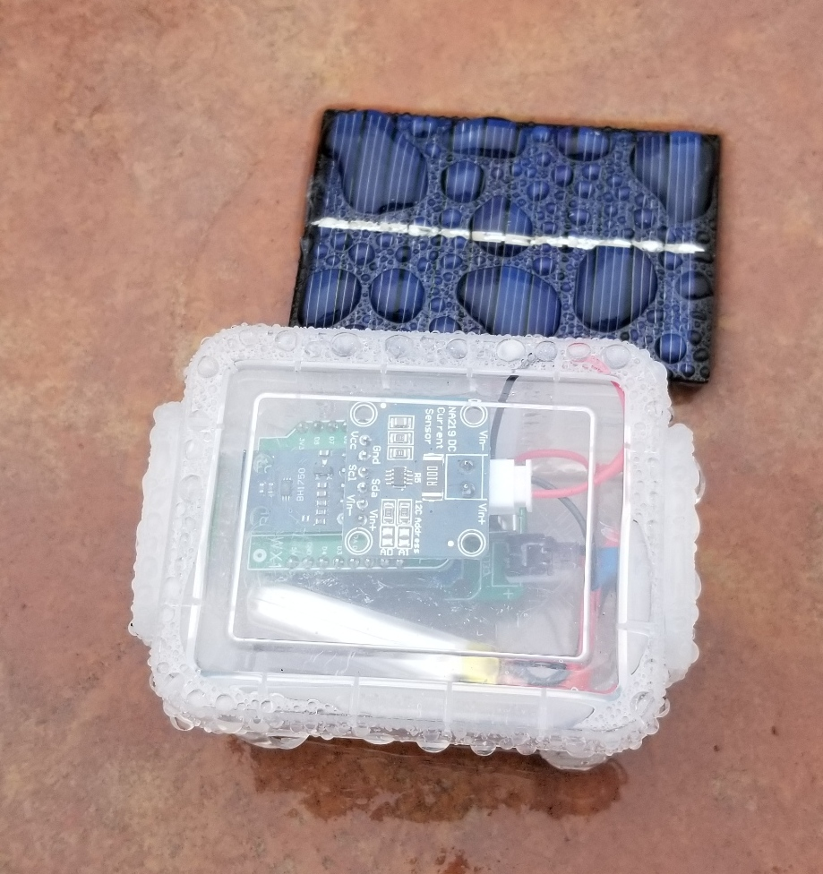
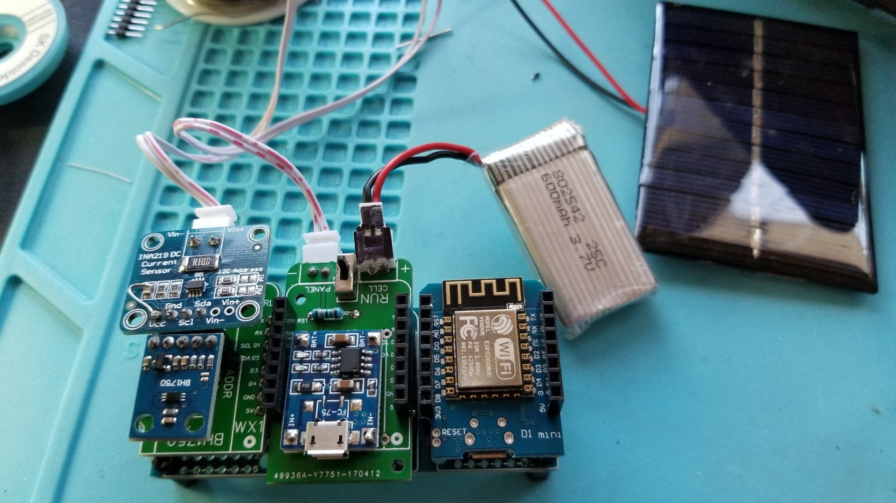

# Project Photo Gallery

## Bench View

### Side view of shields separated

### Assembled Side View

### Top View

### Modification to charger board

### Installation

### Unit in the rain

### Unit reconfigured to use a tripler base

### Tripler base unit mounted inside crayon box

