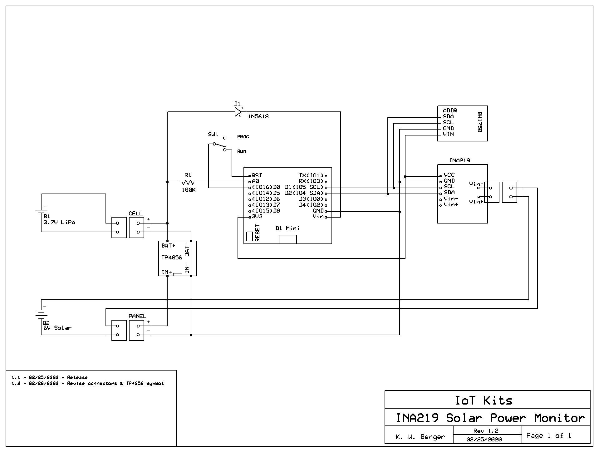
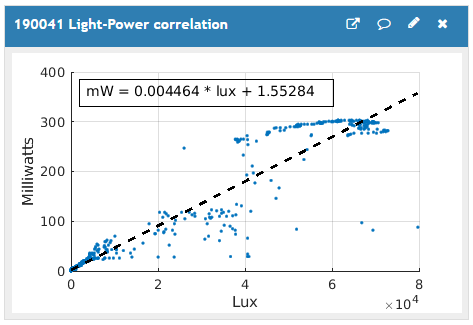
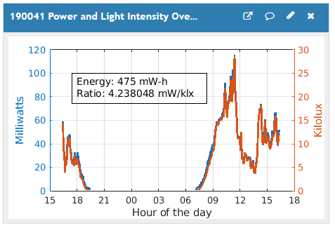

# SolarPowerMonitor
Experimental device to measure solar panel performance

For the Wemos D1 Mini with Arduino software.
Uses a INA219 voltage/current sesnor module to measure solar panel output and a BH1750 for light intensity.

## ThingSpeak_config.h
The sketch needs a ThingSpeak_config.h file. It must be located in the same folder as the sketch D1M-Solar-Monitor.ino file.

Open the sketch in the Arduino IDE. Select the ThingSpeak_config.h or appropriate tab and edit the information for your station as indicated by the comments within the file.

Information needed:
1. Your WiFi SSID (You must use 2.4 GHz not 5 GHz.)
2. Your WiFi password
3. Sleep interval in seconds: 60 for testing, 600 or longer for normal service
4. ThingSpeak channel ID (a numerical value)
5. ThingSpeak API Write Key (alphanumeric between quotes)
6. OPTIONAL (Values determined from running D1M-WX1_Calibration.ino)
  * DMM voltage
  * ADC reading

Save the sketch. Set the RUN switch to the non-RUN (unlabeled) position and upload to the microcontroller. Return the switch to RUN after a sucessful upload.

## Schematic

## MATLAB Scripts
These MATLAB scripts are for your ThingSpeak channel:

### Light_Power_Correlation

### Light and Power Overlayed

