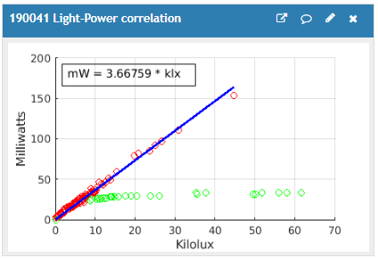

# SolarPowerMonitor
This is an experimental device to measure solar panel performance. It is adapted from the stacked version of the wireless solar-powered weather station kit available from IoT Kits at [w4krl.com/iot-kits](https://w4krl.com/iot-kits/).

It uses the Wemos D1 Mini with Arduino software. Solar panel output is measured by an INA219 voltage/current sesnor module. A BH1750 modules measures light intensity.

The unit periodically transmits the measements to your ThingSpeak channel using the RESTful architecture with HTTP protocol. It goes into deep sleep between transmissions to reduce energy consumption. The D1 Mini can be powered with an external 5 Volt USB adapter if continuous operation is desired.

You can see photographs of the unit at [I'm a relative reference to a repository file](../blob/master/LICENSE)

## Installing the Firmware
To Be Suppled

### ThingSpeak_config.h
The sketch needs a ThingSpeak_config.h file. It must be located in the same folder as the sketch D1M-Solar-Monitor.ino file.

Open the sketch in the Arduino IDE. Select the ThingSpeak_config.h or appropriate tab and edit the information for your station as indicated by the comments within the file.

Information needed:
1. Your WiFi SSID (You must use 2.4 GHz not 5 GHz.)
2. Your WiFi password
3. Sleep interval in seconds: 60 for testing, 600 or longer for normal service
4. ThingSpeak channel ID (a numerical value)
5. ThingSpeak API Write Key (alphanumeric between quotes)
6. OPTIONAL (Values determined from running D1M-WX1_Calibration.ino)
  * DMM voltage
  * ADC reading

Save the sketch. Set the RUN switch to the non-RUN (unlabeled) position and upload to the microcontroller. Return the switch to RUN after a sucessful upload.

## How it works
The solar panel produces power depending upon the brightness of the light falling on the panel. Current flows from the positive terminal of the panel to the Vin+ terminal of the INA219 curent/voltage sensor. It flows out of the Vin- terminal to the IN+ terminal of the TP4056 charge controller and returns to the negative terminal of teh panel from the IN- terminal of the TP4056.

The INA219 measures the current flow from the solar panel to the TP4056 and measures the voltage at the Vin- terminal. This is the same voltage that appears at the TP4056 IN+ terminal. The INA219 also calculates the power from the solar panel.

The TP4056 charge controller passes all current from the solar panel to the Lithium Polymer cell until the terminal voltage of the cell reaches 4.2 Volts at full charge. At that voltage, it limits current to prevent overcharge of the cell.

The LiPo cell supplies power to the ESP8266 microcontroller through Schottky diode D1 and a low dropout voltage regulator on the D1 Mini module. The regulator provides 3.5 volts to the ESP8266 whenever the cell voltage is above that voltage. The D1 Mini can also operate on 5 volt power from the micro USB port. Diode D1 prevents overcharge of teh LiPo cell when the D1 Mini is connected to a USB supply.

The ESP8266 runs in a perpectual cycle as long as the LiPo can provide approximately 3.3 volts or more:
* Initialize sensors (INA219 and BH1750)
* Logon to your WiFi
* Read sensors
* Print data to your serial port
* Post data to your ThingSpeak channel
* Enter deep sleep for one to five minutes

## Schematic

## MATLAB Scripts
These MATLAB scripts are for your ThingSpeak channel:

### Light_Power_Correlation

### Light and Power Overlayed

