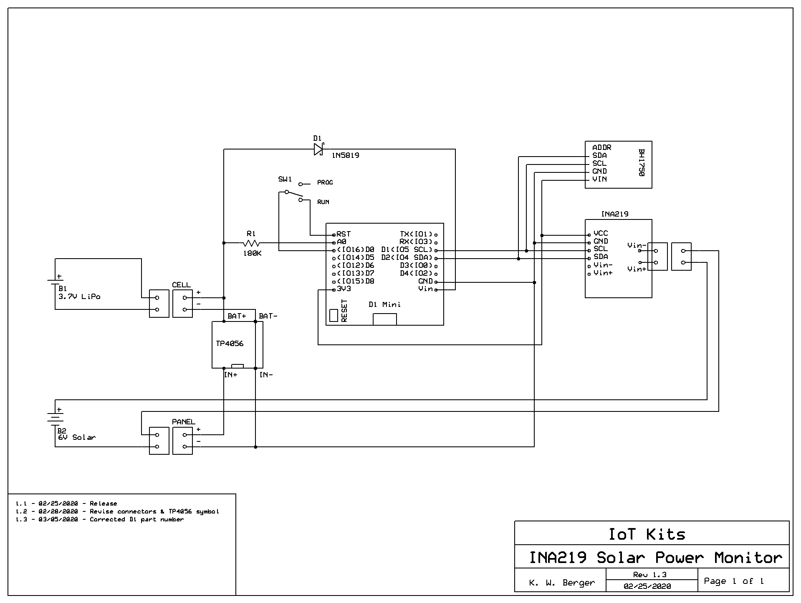

# SolarPowerMonitor
Experimental device to measure solar panel performance

For the Wemos D1 Mini with Arduino software.
Uses a INA219 voltage/current sesnor module to measure solar panel output and a BH1750 for light intensity.

## Schematic

## MATLAB Scripts
These MATLAB scripts are for your ThingSpeak channel:

### Light_Power_Correlation

### Light and Power Overlayed

