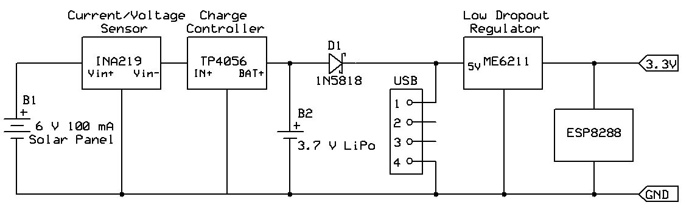

# Solar Power Monitor
This is an experimental device to measure solar panel performance. It is adapted from the stacked version of the wireless solar-powered weather station kit available from IoT Kits at [w4krl.com/iot-kits](https://w4krl.com/iot-kits/). 

It uses the Wemos D1 Mini with Arduino software. Solar panel output is measured by an INA219 voltage/current sensor module. A BH1750 modules measures light intensity.
<!-- a normal html comment -->
The unit periodically transmits the measurements to your ThingSpeak channel using the RESTful architecture with HTTP protocol. It goes into deep sleep between transmissions to reduce energy consumption. 

The D1 Mini receives its energy from the collected solar power. If the solar power is not sufficient to recharge the LiPo cell in darkness the D1 Mini can be powered with an external 5 Volt USB adapter.

Click for project photos: 

## Installing the Firmware
Installation of the Arduino IDE and ESP8266 is described in many tutorials available online. The main thing to note is that the switch on the charger shield must be in the RUN position to operate and the opposite position when uploading firmware to the D1 Mini.

Use the following as a guide:
* Install the latest version of the Arduino IDE as appropriate to your computer available from [www.arduino.cc](https://www.arduino.cc). Do not install the web version.
* Install the ESP8266 core into the Arduino IDE. See instructions at  https://github.com/esp8266/Arduino#installing-with-boards-manager
* Use the Arduino IDE menu item *Tools | Board:* to select **LOLIN(WEMOS) R2 D1 & mini** or whatever version of the ESP8266 you are using.  
* Download the D1M-Solar-Monitor firmware from this repository.
* Use Arduino IDE menu item *Sketch | Include Library | Manage libraries...* to add these sensor libraries:
   - hp_BH1750 by Stefan Armborst
   - Adafruit_INA219 by Adafruit
* Open a ThingSpeak channel at [www.ThingSpeak.com](https://thingspeak.com/) and configure it as described in the ThingSpeak Field Definitions table below.
* Enter your Wi-Fi and ThingSpeak information in the ThingSpeak_config.h file as described below.
* Save yor sketch. Connect your computer to the D1 Mini micro USB port. Verify that the D1 Mini serial port is recognized.
* Set the switch on the charger board to the position opposite the **RUN** position. This is the **PROG** position but it is unlabelled.
* Upload the firmware to the D1 Mini. Set the switch to **RUN** when the upload finishes.

### ThingSpeak Field Definitions
| Field | Name |
| - | ------------- |
| 1 | Light Intensity |
| 2 | Panel Volts |
| 3 | Panel mA |
| 4 | Panel mW |
| 5 | Cell Volts |
| 6 | WiFi Signal |
### Configuring ThingSpeak_config.h
The ThingSpeak_config.h file defines firmware parameters that are unique to your solar power monitor. It must be located in the same folder as the sketch D1M-Solar-Monitor.ino file.

Open the sketch in the Arduino IDE. Select the ThingSpeak_config.h tab and edit the information for your station as indicated by the comments within the file.

Information needed:
1. Your WiFi SSID (You must use 2.4 GHz not 5 GHz.)
2. Your WiFi password
3. Sleep interval in seconds: 60 for testing, 600 or longer for normal service
4. ThingSpeak channel ID (a numerical value)
5. ThingSpeak API Write Key (alphanumeric between quotes)
6. OPTIONAL (Values determined from running D1M-WX1_Calibration.ino)
  - DMM voltage
  - ADC reading

Save the sketch. Set the **RUN** switch to the **PROG** (unlabeled) position and upload to the microcontroller. Return the switch to **RUN** after a sucessful upload.

## How it works
The solar panel produces power depending upon the brightness of the light falling on the panel. Current flows from the positive terminal of the panel to the Vin+ terminal of the INA219 curent/voltage sensor. It flows out of the Vin- terminal to the IN+ terminal of the TP4056 charge controller and returns to the negative terminal of the panel from the IN- terminal of the TP4056.

The INA219 measures the current flow from the solar panel to the TP4056 and measures the voltage at the Vin- terminal. This is the same voltage that appears at the TP4056 IN+ terminal. The INA219 also calculates the power from the solar panel.

The TP4056 charge controller passes all current from the solar panel to the Lithium Polymer cell until the terminal voltage of the cell reaches 4.2 Volts at full charge. At that voltage, it limits current to prevent overcharge of the cell.

The LiPo cell supplies power to the ESP8266 microcontroller through Schottky diode D1 and a low dropout voltage regulator on the D1 Mini module. The regulator provides 3.5 volts to the ESP8266 whenever the cell voltage is above that voltage. The D1 Mini can also operate on 5 volt power from the micro USB port. Diode D1 prevents overcharge of teh LiPo cell when the D1 Mini is connected to a USB supply.

#### Simplified Power Supply Schematic

The ESP8266 runs in a perpectual cycle as long as the LiPo can provide approximately 3.3 volts or more:
* Initialize sensors (INA219 and BH1750)
* Logon to your WiFi
* Read sensors
* Print data to your serial port
* Post data to your ThingSpeak channel
* Enter deep sleep for one to five minutes

## Complete Schematic

## MATLAB Scripts
These MATLAB scripts are for your ThingSpeak channel:

### Light_Power_Correlation
This visualization plots 24-hours of power and light intensity on a scatter chart. It uses the MATLAB plotfit function to fit a linear equation to the data. The equation is displayed on the chart.

Light & Power Correlation 

### Light and Power Overlayed

This visualization plots the power and light intensity with time over 24-hours. It displays the energy collected over the 24-hour period as milliwatt-hours.

Light & Power Overlayed 

